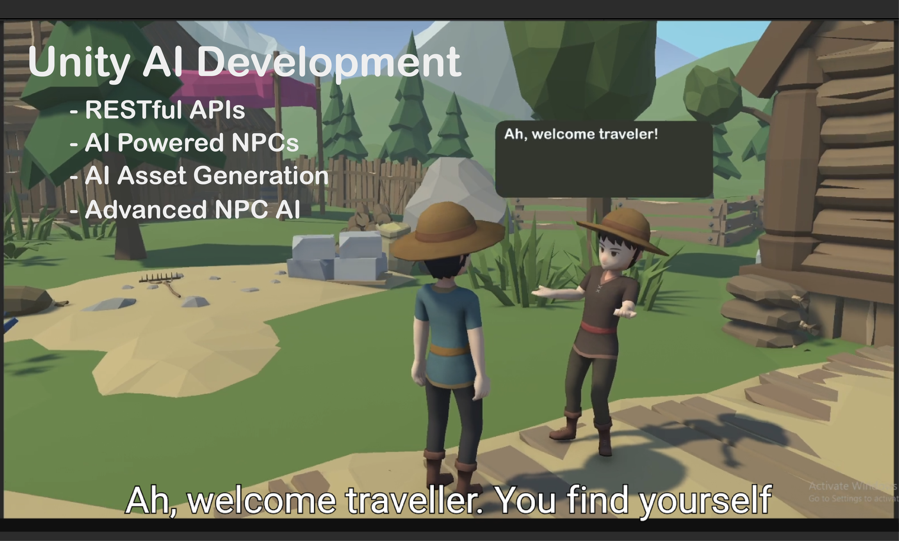

## Real-time responsive NPC with OpenAI API
This project uses OpenAI API for:

* Voice Input (STT)
* Audio to Text Transcribtion
* AI Response Generation – GPT-powered dialogue logic
* Voice Output (TTS)

## How to install?
1- Download the project and open it.
2- You can use the AIManagers scripts for API calls
3- If you want complete NPC then you can grab the NPC prefab and that should do it

## A Demo Video:
